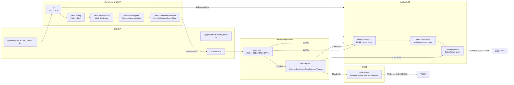

# Symphony SAS 完整信号流（基于 Model_1_1.c）

> 来源：`cart-cicd-erev/components/symphony/src/out/baremetalgxp/slx/code/Model_1_1_ert_shrlib_rtw/Model_1_1.c`（20 641 行）+ `PostProcess.c`  
> 采样率 48 kHz，块大小 32，帧率 1.5 kHz。

## 1. 顶层 TID 调用顺序

```text
Model_1_1_step0()  @ 0.6667 ms  (TID0, 主实时链)
  ├─ SymphonyPart2FdpFullRateTID0()   // FDP 输入缓冲 + 输出缓冲
  ├─ SymphonyPart3FullRateMixing()    // 13ch -> 22ch 矩阵混音
  ├─ SymphonyPart4FullRatePeripheralEq() // 22ch IIR + 延迟
  ├─ SymphonyPart5FullRatePostHoligram() // SleepingBeauty + 相位对齐延迟
  ├─ SymphonyPart6SummationAndPreAmp()   // 求和 + 扬声器延迟 + 淡入淡出
  ├─ Subsystem Switch                // Part6 输出 -> 22ch feedback -> MusicIn
  ├─ InputSelect()                   // 30ch MusicIn -> 12ch Ent + 1ch Mic + 17ch Ann
  ├─ PreAmpPart1()                   // 化妆增益/下混/音调/平衡/音量/电平检测
  ├─ PostProcess_c()                 // 限幅/EQ/软削波/校准/延迟 -> 22ch 输出
  └─ Audiopilot35 (inline)           // 噪声估计 + 动态 EQ/AudioPilot 增益

Model_1_1_step1()  @ 1.3333 ms  (TID1)
  └─ Audiopilot35 低速缓冲更新(BufferRef/BufferMic)

Model_1_1_step2()  @ 2.6667 ms  (TID2)
  └─ SymphonyPart2FdpFullRateTID2()   // FDP FFT 慢链：2ch -> 6ch

Model_1_1_step3()  @ 42.6667 ms (TID3)
  └─ Audiopilot35 HF noise coherence / FFT 分析

Model_1_1_step4()  @ 170.6667 ms
Model_1_1_step5()  @ 512 ms
  └─ 慢速控制/指标更新
```

---

## 2. 主实时信号流（step0）

### 2.1 宏观图



### 2.2 各子系统数据类型 / 通道数变化

| 节点 | 输入通道 | 输出通道 | 关键内部通道 |
|---|---|---|---|
| InputSelect | 30 | 30 (Assignment_m) | 12 Ent, 1 Mic, 17 Ann |
| PreAmpPart1 MakeupGain | 12 | 12 | |
| InputMixer3D | 12 | 10 (Switch1) | 2.0 stereo 或 5.1.4 |
| LevelDetectDelay | 10 | 10 | |
| Volume (rgainy) | 10 | 10 | |
| Tone (Bass/Mid/Treble) | 10 | 10 | |
| Balance | 10 | 10 | 4 rampers |
| PreEqRouter | 10 | 32 Buffer | 实际 6ch 有效 |
| Audiopilot Buffer2 | 1 Mic | 1 | |
| Audiopilot Noise Filters | 1/4/10 | 1/10/10 | |
| Audiopilot GainApplication | 10 | 10 | |
| PostProcess | 32 Buffer | 22 | ASDRouter 选主/辅 |
| FDP TrebleDelay | 2 | 2 | |
| FDP BufferIn/Out | 2 -> FDP -> 6 | 6 | |
| Part3 Mixing | 6 (BufferOut) + 7 (TrebleSurround) = 13 | 22 | Cs 2ch + Left 10ch + Right 10ch |
| Part4 PeripheralEQ | 22 | 22 | IIR + ChannelDelay |
| Part5 PostHoligram | 22 | 22 | 4 SB rampers + PhaseAlignmentDelay |
| Part6 Summation | 22 (deci) + 22 (full) = 22 | 22 | SpeakerDelay + SpatialFader + MuteRamper |

---

## 3. 子系统内部展开

### 3.1 InputSelect

```text
MusicIn[30ch] --(tuneTopMap/rtcMap)--> Assignment_m[30ch]
                                        |
                                        ├─ VariableSelector  -> MatrixConcatenate_kk[17ch Ann] (indices 0..16)
                                        ├─ VariableSelector1 -> VariableSelector1[12ch Ent]
                                        └─ VariableSelector5 -> VariableSelector5[1ch Mic]
```

- Router MATLAB Function：30 路选择表，RTC 可覆盖 tune 值。
- 无效索引通道置零。

### 3.2 PreAmpPart1

```text
VariableSelector1[12ch Ent]
  -> MakeupGain (scalar gain)
  -> InputMixer3D
       ├─ AddWeights: 7.1.4 -> 5.1.4 (LfeGain, Lsr->Ls, Rsr->Rs)
       ├─ DownmixToStereo: 7.1.4 -> 2.0.0 (10ch, 仅 L/R 非零)
       ├─ Send514Out: 7.1.4 -> 5.1.4 SMPTE (10ch)
       └─ Switch1: StereoDnMix ? stereo(10ch) : 5.1.4(10ch)
  -> LevelDetectMusicDelay[10ch]
  -> rgainyprocess_g (volume ramping) [10ch]
  -> tone  (bass boost/cut IIR)      [10ch]
  -> tone_l(treble boost/cut IIR)    [10ch]
  -> tone_o(midrange boost/cut IIR)  [10ch]
  -> balanceProcess (4 rampers)      [10ch]
  -> PreqRouterOut1 (tune/rtc map)   [32ch Buffer]   // 供 PostProcess 的 TestRouter
  -> Buffer1 (tone/balance 后)       [10ch]          // 供 Audiopilot GainApplication
  -> PoolIirProcess (software)       [10ch]          // 预加重，供电平检测
  -> PreProcess: RMS + Peak -> dB
  -> InnerLink x2 (Audiopilot & Dyneq envelope)
  -> Buffer2 (Mic)                   [1ch]
```

### 3.3 PostProcess

```text
Buffer[32ch]
  -> Model_1_1_PostProcess()
       ├─ rgainyprocess (22ch ramping)
       ├─ Limiter (22ch, per-channel attack/decay/k1/maxAttack)
       ├─ PostEQ IIR (22ch, iir_accelerator_process)
       ├─ SoftClipper (22ch)
       ├─ RMDL MuteRamper (global ramp -> 22ch)
       └─ TestMode matrix mix (10ch -> 22ch, 测试模式)
  -> TestRouter/ASDRouter
       ├─ Bypass: Model_PreqOut1[32ch] -> MatrixConcatenate_kk[0..31]
       ├─ MainChannelSubSystem: 22ch select from 71 source map + gain
       └─ AuxChannelSubSystem: optional aux mix
  -> OutputCalibration: 22ch * OutputCalVals[22]
  -> FreqComp IIR (22ch, iir_accelerator_process)
  -> TunablePoolDelay (22ch)
  -> Model_AudioOut32[22ch]
```

### 3.4 Symphony Part2 FDP

```text
TID0:
  TrebleLr[2ch]
    -> SymphonyTrebleDelay (2ch)
    -> BufferIn (2ch x 32 ring)
    -> BufferOut (6ch x 32 ring) => Model_1_1_B.BufferOut[6ch]
    -> Selector: BufferOut[6ch] -> LoRoLimpRimp[4ch] (indices 0,1,2,4)

TID2:
  BufferIn (2ch x 128) -> Model_1_1_Fdp() [FFT-based 2->6 splitter]
  -> BufferOut (6ch x 128)
```

### 3.5 Symphony Part3 FullRate Mixing

```text
TrebleSurround[7ch] -> SymphonyAlignmentDelay[7ch]
                       -> SelectSurroundDiscrete[3ch]
                       -> SelectLeftSurroundAtmos(Ltf+Ltb) -> Sum -> 1ch
                       -> SelectRightSurroundAtmos(Rtf+Rtb) -> Sum -> 1ch
                       => Merge1[5ch?] + audioOut_o[7ch]

BufferOut[6ch] + audioOut_o[7ch] = MatrixConcatenate1[13ch]
  -> SymphonyFullRateMixEq IIR (software pooliirSplitProcess, 13ch)
  -> InputOrganizer:
       LeftFdp   = [Lo, Limp, Ltail]      (indices 0,2,3)
       RightFdp  = [Ro, Rimp, Rtail]      (indices 1,4,5)
       CenterAtmos = Csi                  (index 6)
       LeftAtmos = [Lsi, Ltfi, Ltbi]      (indices 7,9,10)
       RightAtmos= [Rsi, Rtfi, Rtbi]      (indices 8,11,12)
       CsInput   = [LeftFdp LeftAtmos RightFdp RightAtmos CenterAtmos] (13ch)
       LeftInput = [LeftFdp LeftAtmos CenterAtmos] (7ch)
       RightInput= [RightFdp RightAtmos CenterAtmos] (7ch)
  -> RampProcessing (3 matrix mixes, sequence-controlled ramping)
       CsMix:   13ch -> 2ch  (gains 26)
       LeftMix:  7ch -> 10ch (gains 70)
       RightMix: 7ch -> 10ch (gains 70)
       => Merge[22ch]
```

### 3.6 Symphony Part4 / Part5 / Part6

```text
Part4:
  Merge[22ch] -> Selector1 (channel reorder tmp[]) -> FullRateEq IIR[22ch]
              -> ChannelDelay[22ch] -> Merge[22ch]

Part5:
  Merge[22ch] -> sleepingBeautyProcess (4 rampers: L/R/C/Mono)
              -> SymphonyTunableDelay (PhaseAlignmentDelays[22])
              -> Buffer[22ch]

Part6:
  Buffer[22ch] + SymphonyPart5DeciRatePostHoligram_AudioOut[22ch]
              -> Add[22ch]
              -> SpeakerDelay[22ch]
              -> SymphonyOutputRouter (routing map 22->22)
              -> SpatialFader (lpf + fade rampers)
              -> MuteRamper (global ramp)
              -> ImpAsg_InsertedFor_Out1_at_inport_0[22ch]
              -> Subsystem Switch -> Model_1_1_B.Switch[22ch] -> MusicIn feedback
```

### 3.7 Audiopilot35（step0 inline）

```text
Buffer2[1ch Mic]
  -> MuteLPF * Delay1[4ch]  -> MatrixConcatenate[10ch]
  -> MuteBPF * Delay2[5ch]  ->
  -> HFNoise BP/LP IIR (10ch) -> Downsample2 -> Selector1 -> Delay -> MatrixConcatenate_k[10ch] -> Buffer
  -> LFNoise FilterMic IIR (1ch) -> BufferMic
  -> MuteLF * Delay[1ch] -> LFNoise FilterRef IIR (1ch) -> BufferRef

Buffer1[10ch]
  -> Bpf (2nd order, 10ch)
  -> ZipperNoiseReductionBpf
  -> ApplyBpfGain
  -> Lpf (4th order, 10ch)
  -> ZipperNoiseReductionLpf
  -> ApplyLpfGain
  -> Wide gain (zipper reduction)
  -> ApplyWideGain
  -> Delay (Lpf alignment)
  -> Sum with Bpf/Lpf branches
  -> Audiopilot35_Out1[10ch]

GainCalculation:
  InnerLink levels (AudioPilot & Dyneq)
  InputOverRide (DynEq/AudioPilot signal override)
  NoiseOverRide (LF/WB/HF/Ratio override)
  AlphaCalculation (HF alpha * LF beta)
  BoostMapAdjustments (ratio -> Bass/Mid/Treble slope/threshold)
  Ramper (dyneq_on / audiopilot_on ramping)
  -> BassBoost, MidBoost, TrebleBoost, DyneqBoost
```

---

## 4. 平台相关 IIR / pooliir 替换表

当前 Orpheus 只有 `orpheus.builtin.iir_bank`，它假设所有通道共享同一组级联系数。Symphony 中大量实例需要**每通道不同系数**或**每通道不同级数**。因此要么扩展 `iir_bank`，要么每个通道使用独立 `iir_bank`。

| # | 位置 | 原函数 | 通道数 | 说明 | Orpheus 替换 |
|---|---|---|---|---|---|
| 1 | PostProcess.c:1048 | `iir_accelerator_process` | 22 | PostEQ，每通道 1 级 IIR，频率不同 | 22x `iir_bank`(1 stage) 或扩展 `iir_bank` 支持 per-channel 系数 |
| 2 | Model_1_1.c:4660 | `iir_accelerator_process` | 22 | OutputCalibration FreqComp，每通道 1 级 | 同上 |
| 3 | Model_1_1.c:8996 | `pooliirSplitProcess` | 10 | PreAmp LevelDetect 预加重，软件 pooliir | `iir_bank` (共享系数可能可行) |
| 4 | Model_1_1.c:12473 | `pooliirSplitProcess` | 13 | Symphony Part3 MixEq，软件 pooliir，每通道不同 | 13x `iir_bank` 或扩展 |
| 5 | Model_1_1.c:13297 | `iir_accelerator_process` | 22 | Symphony Part4 PeripheralEQ | 22x `iir_bank` 或扩展 |
| 6 | Model_1_1.c:15762 | `iir_accelerator_process` | 10 | Audiopilot HF noise BP/LP | 10x `iir_bank` 或扩展 |
| 7 | Model_1_1.c:15818 | `iir_accelerator_process` | 10 | Audiopilot HF anti-aliasing | 10x `iir_bank` 或扩展 |
| 8 | Model_1_1.c:16030 | `iir_accelerator_process` | 1 | Audiopilot LF mic filter | 1x `iir_bank` |
| 9 | Model_1_1.c:16104 | `iir_accelerator_process` | 1 | Audiopilot LF ref filter | 1x `iir_bank` |
| 10 | PreAmpPart1 tone x3 | `Model_1_1_tone` | 10 | Bass/Mid/Treble shelf IIR | 10x `iir_bank` 每段或新增 `shelf_eq` 组件 |
| 11 | Audiopilot Bpf/Lpf | inline DiscreteFilter | 10 | 2nd/4th order IIR | 多实例 `iir_bank` |
| 12 | Part6 SpatialFader lpf | inline 1st order | 22 | 淡入淡出平滑 LPF | 22x 一阶 `iir_bank` 或新增 `smoothing_filter` |

**总计约 9 个 pooliir/iir_accelerator 实例 + 多个离散 IIR。**

---

## 5. 与当前 `symphony_sas_step0.yaml` 中 `model_tree` 的对照

当前蒸馏展开后主链：

```text
sys_in -> input_select -> preamp_part1 -> part2_fdp -> part3_mixing ->
part4_peripheral_eq -> part5_post_holigram -> part6_summation ->
post_process -> audiopilot -> sys_out
```

### 5.1 结构级差异

| 差异点 | 真实 Model_1_1.c | 当前蒸馏 |
|---|---|---|
| **调用顺序** | Part2/3/4/5/6 先于 InputSelect/PreAmp/PostProcess 执行 | 把 FDP 放在 PreAmp 之后 |
| **反馈环** | Part6 输出 22ch 反馈到 MusicIn，形成闭环 | 无反馈，纯线性链 |
| **输入数量** | MusicIn 30ch + TrebleLr 2ch + Mono 1ch | 仅 sys_in |
| **输出数量** | Model_AudioOut32 22ch + Audiopilot35_Out1 10ch | 仅 sys_out |
| **多速率** | TID0/TID1/TID2/TID3 分工明确 | 基本忽略 |
| **PostProcess 位置** | 在 PreAmpPart1 之后，处理 32ch Buffer | 在 Symphony 链末尾，处理 22ch |
| **Audiopilot 位置** | 在 step0 末尾 inline，依赖 PreAmp 的 Buffer1/Buffer2/Mic | 作为独立节点接在 PostProcess 后 |

### 5.2 被 `_is_noise()` 误删的模块

当前 `_NOISE_RE` 过滤了 `buffer|delay|rampcoeff|ratetransition` 等关键字，导致以下真实功能块丢失：

- `SymphonyTrebleDelay`
- `SymphonyAlignmentDelay` / `TrebleSurroundDelay`
- `ChannelDelay` (Part4)
- `SymphonyTunableDelay` / `FullRateHoligramDelay`
- `SpeakerDelay`
- `LevelDetectMusicDelay`
- `Audiopilot Delay1 / Delay2 / Delay`
- `TunablePoolDelay` (PostProcess)
- `BufferIn / BufferOut / BufferMic / BufferRef / Buffer`
- `RateTransition`（用于跨 TID 参数传递）
- `RampProcessing` 中的 `rampcoeff`

### 5.3 被 `parse_flow()` 线性化丢失的并行结构

- FDP 的 2ch->6ch 分支结构
- Part3 中 3 个矩阵混音（CsMix, LeftMix, RightMix）并行
- Part3 中 7ch TrebleSurround 的处理和求和
- InputMixer3D 的 2.0/5.1.4 Switch
- Audiopilot 的 HF/LF/Ref/Mic 多路噪声估计
- PostProcess 中 Limiter/PostEQ/SoftClip 的并行参数集（high/low）

### 5.4 缺少的组件 / 能力

| 缺失组件 | 说明 |
|---|---|
| 可变引脚 router / selector | InputSelect、PreqRouterOut1、ASDRouter 都是索引选择 |
| 每通道系数 IIR | 大量 22ch/13ch/10ch IIR 需要 per-channel coeffs |
| 多速率 buffer / downsample | TID1/TID2/TID3 需要跨速率缓冲 |
| SleepingBeauty / spatial fader | Part5/Part6 的特定功能 |
| 电平检测 + InnerLink | Audiopilot/Dyneq 包络检测 |
| Limiter + SoftClipper | PostProcess 核心 |
| 矩阵混音带 ramping | Part3 的 sequence-controlled ramping |
| 全局/每通道 MuteRamper | PostProcess RMDL、Part6 Mute、PreAmp Volume |

---

## 6. 下一步建议

1. **扩展 `iir_bank`**：支持 per-channel 系数和级数，或提供 `iir_bank_per_channel` 组件。
2. **新增/复用组件**：
   - `matrix_mix`（支持可变增益矩阵 + ramping）
   - `channel_router` / `channel_selector`
   - `delay_line`（支持 per-channel 延迟）
   - `limiter`、`soft_clipper`、`shelf_eq`
   - `level_detect` / `envelope_follower`
   - `mute_ramper`
3. **重写 `distill_topology.py`**：
   - 移除/收紧 `_NOISE_RE`，保留 buffer/delay/rate-transition。
   - 支持并行分支、反馈环、多 TID 子图。
   - 支持 `task_flows` 中显式多速率节点。
4. **完善 `symphony_sas_step0.yaml` 的 `model_tree`**：
   - 按真实调用顺序排列子系统。
   - 为每个子系统添加内部展开链，不省略中间 buffer/delay。
   - 添加 FDP/Audiopilot 多速率 tap。
